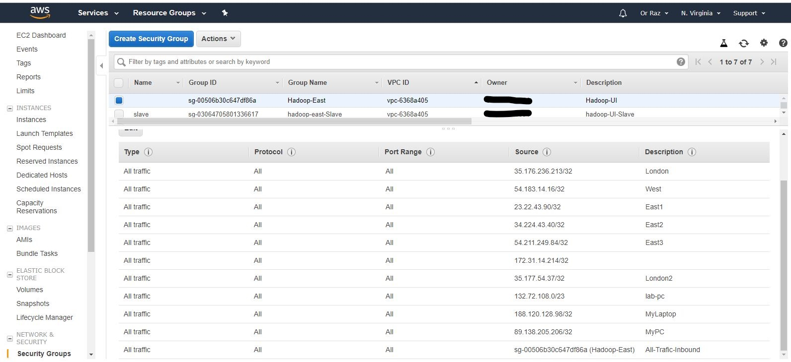
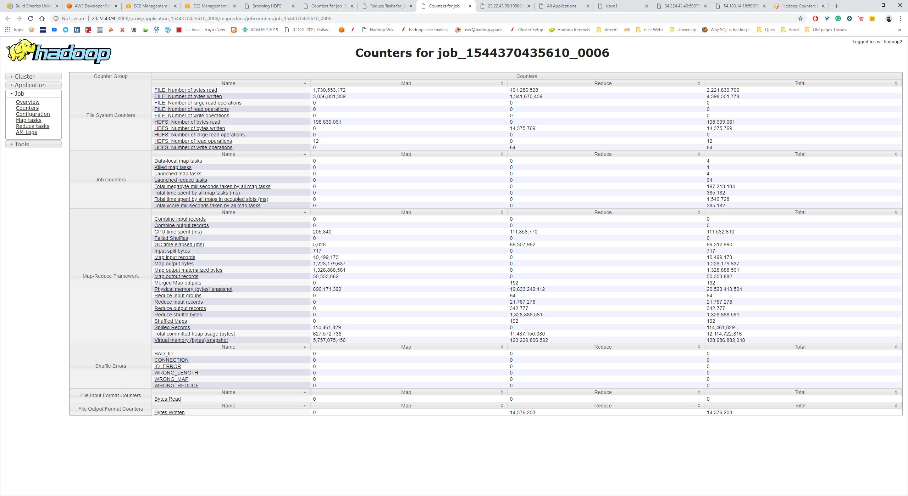

# Nap
Nap: Network-Aware Data Partitions for Efficient Distributed Processing

Data partition _modification_ which considers the _network_ (nodes' downlinks) for a shorter mutliway join in _Hadoop_.

## Table of Contents
* [Introduction](#introduction)
* [Features](#features)
* [Technologies](#technologies)
* [Usage](#usage)
   * [Running Hadoop Multi Node Cluster? Step by Step](#running-hadoop-multi-node-cluster-step-by-step)
     * [Commands Before Running Daemons](#commands-before-running-daemons)
     * [Setting Cluster Configuration Files](#setting-cluster-configuration-files)
     * [Commands for Running Daemons](#commands-for-running-daemons) 
   * [Running Job With and Without Network Awareness](#running-job-with-and-without-network-awareness)    
   * [How to Test Cluster Links?](#how-to-test-cluster-links)
   * [How to Collect the Job's Parameters and Make Figures?](#how-to-collect-the-jobs-parameters-and-make-figures)
   * [Useful Commands](#useful-commands) 
* [Documentation](#documentation)
   * [Job Modification and Partitioner Class (Java)](#job-modification-and-partitioner-class-java)
     * [Job Modification](#job-modification)
     * [Partitioner Class](#partitioner-class)
   * [How to Run Wonder Shaper?](#how-to-run-wonder-shaper)
   * [How to Access Daemons URIs?](#how-to-access-daemons-uris)
* [Sources](#sources)
* [Contact](#contact)

## Introduction
It is well known that in many Distributed Processing the __network__ influnce graetly the task finish time, and it could even be the _bottleneck_ of the task or the larger job.
 __Apache Hadoop__  (as well as _Apache Spark_) which is widely accpepted framework in the Big Data industry does not take into account the _network_ topology, unaware of it when running a job. The problem lies in __*Apche YARN*__ which is in charge of the allocation procedure of containers (map, reduce and am) between and inside jobs. It has a basic assumption that the processing is performed with a homogeneous computers, but when they are heterogeneous the system performance is inefficient. Thus, we have been _modifying Hadoop_ for a better partition of the data in the network, and thus minimizing the job's completion time. 

The following file includes all the needed information for using the code and reproduce the experiment as in the [article](#Contact), more useful functionalites and code during my research with _Hadoop Multi Node cluster_.
 
## Features
This repository includes:
+ DownUp_SpeedTest - Testing downlink and uplink between nodes (see [How to Test Cluster Links?](#how-to-test-cluster-links))
+ hadoop - An Hadoop 2.9.1 network aware compiled version (without the source code), the output from compiling project [see @Nap-Hadoop-2.9.1](https://github.com/razo7/Nap-Hadoop-2.9.1).
+ Input- txt files for WordCount example or three tables join, multiway join.
+ mav-had - Maven Eclipse folder with POM file and relavent code under `Nap\mav-had\src\main\java\run` (see [Job Modification and Partitioner Class (Java)](#job-modification-and-partitioner-class-java))
  + `AcmMJ.java` - Old implematation of the multiway join (without secondary sort)
  + `AcmMJSort.java` - Current implematation of the multiway join (with secondary sort), __use this one__.
  + `Nap.java` - Alogrithm _Nap_ from the paper in Java (it also normalize the links).
  + `WordCountOR.java` - Old wordcount example.
  + `WordCountOR2.java` - Current wordcount example, __use this one__.
  + Other Java files under `Nap\mav-had\src\main\java` are old examples.
+ job History (see [Job History](#how-to-collect-the-jobs-parameters-and-make-figures))- 
   + python code for parsing with REST API the job history server `downJobHistory.py`.
   + .xlsx files with the counters infromation of the jobs.
   + Wolfram Mathematica code `HadoopJobStatistics3.nb` and .xlsx files  for making figures.
   + An example of the counters for job_1544370435610_006 from the Job History using REST API (see the URL) `JobHistory Counters Example.PNG`
+ .gitattributes - git lfs file
+ ec2-proj2.pem - RSA key for EC2 
+ LICENSE - Apache License 2.0 
+ README.md - This README file
+ Security Group Example.jpg - An example of group policy in AWS inbound.

## Technologies
* Hadoop 2.9.1
* Java 8
* Python 2.7
* Wolfram Mathematica 11.0
* Git 2.20.1 and Git lfs 2.6.1

## Usage

### Running Hadoop Multi Node Cluster? Step by Step
This was tested on two different clusters:
   + Weak cluster- Three computers, each has Intel core 2 duo, 4 GB RAM, 2 cores, 150GB Disk and Ubuntu 16.04 LTS.
   + Strong cluster (AWS)- Four t2.xlarge, each has Intel core 2 duo, 16 GB RAM, 4 VCPU, 100GB Disk, 10 Gbps link and Ubuntu 14.04 LTS.
   One of the instances is a master for NameNode (NN) and Resource Manager (RM), and the rest are three slaves for Datanode (DN), and Node Manager (NM).
#### Commands Before Running Daemons
All of this commands are recommended for a running a new computer, when you have a new cluster on AWS but if not just do the steps (on _numbers_) and make sure the rest is covered.

+ USER (Skip)- Create a user, _hadoop2_, and grant it with permissions, the name of this user will be used also as the user for HDFS. 
```
sudo useradd -m hadoop2
sudo passwd hadoop2

sudo usermod -aG sudo hadoop2	#Add user 'hadoop2' with sudo group	
su hadoop2

cd
```
+ GIT (Optional to use Git)- For big files to upload we need git-lfs 
```
sudo add-apt-repository ppa:git-core/ppa
curl -s https://packagecloud.io/install/repositories/github/git-lfs/script.deb.sh | sudo bash
sudo apt-get install git-lfs
git lfs install

git config --global credential.helper cache
git clone https://github.com/razo7/Nap.git
```
+ IPV6 (Optional)- Disable ipv6, Append the following to the end of the file 
```
sudo nano /etc/sysctl.conf   	
	#disable ipv6
net.ipv6.conf.all.disable_ipv6 = 1
net.ipv6.conf.default.disable_ipv6 = 1
net.ipv6.conf.lo.disable_ipv6 = 1
```
1. JAVA- Download Java 8
```
sudo add-apt-repository ppa:webupd8team/java
sudo apt-get update
sudo apt-get install oracle-java8-installer
```
2. ENV- Set enviroment variables (use .bashrc or use export each time, for finding jre run `sudo update-alternatives --config java`)
```
sudo nano .bashrc
JAVA_HOME="/usr/lib/jvm/java-8-oracle"
JRE_HOME="/usr/lib/jvm/java-8-oracle/jre"
### HADOOP Variables ###
HADOOP_PREFIX="/usr/local/hadoop"
HADOOP_HOME="/usr/local/hadoop"
HADOOP_INSTALL="/usr/local/hadoop"
HADOOP_MAPRED_HOME="/usr/local/hadoop"
HADOOP_COMMON_HOME="/usr/local/hadoop"
HADOOP_HDFS_HOME="/usr/local/hadoop"
YARN_HOME="/usr/local/hadoop"
HADOOP_COMMON_LIB_NATIVE_DIR="/usr/local/hadoop/lib/native"
HADOOP_CONF="/usr/local/hadoop/etc/hadoop"
HDFS_COMM="/usr/local/hadoop/bin/hdfs"
HADOOP_USER_NAME="hadoop2"
COMPILED_HADOOP="/home/hadoop2/intelliji_workspace/hadoop-2.9.1-src/hadoop-dist/target/hadoop-2.9.1"
PATH="/usr/local/sbin:/usr/local/bin:/usr/sbin:/usr/bin:/sbin:/bin:/usr/games:/usr/local/games:/usr/local/hadoop/bin:/usr/local/hadoop/sbin"

. .bashrc
```
+ HADOOP (Optional)- Copy hadoop direcory from my Github repository (Nap) 
```
sudo cp -r ~/Nap/hadoop /usr/local/
sudo chmod -R 777 $HADOOP_HOME #create hadoop direcory with premission
sudo chown -R hadoop2:hadoop2 /usr/local/hadoop
```
+ TIME (Optional)- choose a consistent timezone 
```
echo "Asia/Jerusalem" | sudo tee /etc/timezone
sudo dpkg-reconfigure --frontend noninteractive tzdata
```
+ MySQL (Optional)- Create a database 
```
mysql   -u  root   -p
root
CREATE DATABASE acm_ex;
```
+ PSSH (Optional)- Enables Parallel SSH 
```
sudo apt install python-pip python-setuptools  #install PIP for PSSH – Parallel SSH
sudo apt-get install pssh
```
+ Hostname (Optional)- Update hostname 
``` sudo nano /etc/hostname ```
3. HOSTS- Update hosts names for easy ssh - the following is an example using Public IPs (MASTER_NAME- master), *important* for using Hadoop.
```
sudo nano /etc/hosts #every node all the other nodes in the cluster by their name
127.0.0.1 localhost
23.22.43.90 master # for master-> "172.31.24.83 master"
34.224.43.40 slave1
54.211.249.84 slave2
54.183.14.16 slave3
35.176.236.213 slave4
35.177.54.37 slave5
```
4. EXCHANGE KEYS- make a passwordless ssh to all the slaves- create key and exchange it OR ssh and save the key as in the terminal it might ask, *important* for using Hadoop.
```
ssh-keygen -t rsa -P '' -f ~/.ssh/id_rsa # create an RSA key without authntication and save it to ~/.ssh/id_rsa
cat ~/.ssh/id_rsa.pub >> ~/.ssh/authorized_keys #move it  ~/.ssh/authorized_keys
chmod 0600 ~/.ssh/authorized_keys #change authorizations to the file, everybody can read it...
ssh-copy-id -i ~/.ssh/id_rsa.pub slave1 #send rsa key to all the slaves... 
ssh-copy-id -i ~/.ssh/id_rsa.pub slave2 
ssh-copy-id -i ~/.ssh/id_rsa.pub slave3 
ssh-copy-id -i ~/.ssh/id_rsa.pub slave4 
ssh-copy-id -i ~/.ssh/id_rsa.pub slave5 
```
5. SLAVES FILE- UPDATE HADOOP_CONF, *important* for using Hadoop.
```
slave1
slave2
slave3
slave4
slave5
```
+ CLEANING (Optional)- Clean old files and copy from GIT 
```
sudo rm -rf $HADOOP_HOME/*
sudo cp -r Nap/hadoop/* $HADOOP_HOME
sudo mkdir -p $HADOOP_HOME/data/hadoop-data/nn $HADOOP_HOME/data/hadoop-data/snn $HADOOP_HOME/data/hadoop-data/dn $HADOOP_HOME/data/hadoop-data/mapred/system $HADOOP_HOME/data/hadoop-data/mapred/local #create direcories for future logs if they are not existed
```
6. COPYING- UPDATE HADOOP_CONF, copying from one node to the rest 
```
parallel-ssh -h $HADOOP_CONF/slaves "rm -rf $HADOOP_HOME/*"
scp -r $HADOOP_HOME/* slave1:$HADOOP_HOME
scp -r $HADOOP_HOME/* slave2:$HADOOP_HOME
scp -r $HADOOP_HOME/* slave3:$HADOOP_HOME
scp -r $HADOOP_HOME/* slave4:$HADOOP_HOME
scp -r $HADOOP_HOME/* slave5:$HADOOP_HOME
parallel-ssh -h $HADOOP_CONF/slaves "chmod -R 777 $HADOOP_HOME"
parallel-ssh -h $HADOOP_CONF/slaves "chown -R hadoop2:hadoop2 /usr/local/hadoop"
```
+ UPDATE JAVA ENV (Optional)- Might need to update two enviroment variables used by Hadoop in Nap/hadoop/etc/hadoop/hadoop-env.sh 
    + FOR ORACLE
    ```
    export JAVA_HOME="/usr/lib/jvm/java-8-oracle"
    export HADOOP_HOME="/usr/local/hadoop"
    ```
    + FOR OPENJDK
    ```
    export JAVA_HOME="/usr/lib/jvm/java-8-openjdk-amd64"
    export HADOOP_HOME="/usr/local/hadoop"
    ```
+ SECURITY GROUP in AWS (Only for AWS cluster)- Create security group (per region) and change the inbound rules with All-TRAFFIC rules for each machine in the cluster (elastic IP) as in the following example. 


#### Setting Cluster Configuration Files 
An example of modifing the cluster configuration files, `Nap\hadoop\etc\hdfs-site.xml`, `Nap\hadoop\etc\core-site.xml`, `Nap\hadoop\etc\mapred-site.xml`, and `Nap\hadoop\etc\yarn-site.xml`.
Change the _MASTER_NAME_ to a defined name in the `/etc/hosts`, i.e., master.
1. hdfs-site.xml
```
<configuration>
    <property>
        <name>dfs.replication</name>
        <value>2</value>
                <description>Default block replication, up to the number of datanodes</description>
    </property>
    <property>
        <name>dfs.blocksize</name>
        <value>8388608</value>
                <description>Block size in bytes, the default is 128MB= 128 * 1024 * 1024, it was dfs.block.size</description>
    </property>
    <property>
        <name>dfs.namenode.name.dir</name>
        <value>file:///usr/local/hadoop/data/hadoop-data/nn</value>
                <description>Directory for storing metadata by namenode</description>
    </property>
    <property>
        <name>dfs.datanode.data.dir</name>
        <value>file:///usr/local/hadoop/data/hadoop-data/dn</value>
                <description>Directory for storing blocks by datanode</description>
    </property>
    <property>
        <name>dfs.namenode.checkpoint.dir</name>
        <value>file:///usr/local/hadoop/data/hadoop-data/snn</value>
    </property>
	
</configuration>
```
* Add the next two properties when running in EC2.*
```

    <property>
        <name>dfs.client.use.datanode.hostname</name>
        <value>true</value>
        <description>Whether clients should use datanode hostnames when connecting to datanodes.</description>
    </property>
    <property>
        <name>dfs.datanode.use.datanode.hostname</name>
        <value>true</value>
        <description>Whether datanodes should use datanode hostnames when connecting to other datanodes for data transfer.</description>
    </property>
	
```

2. core-site.xml
```
<configuration>
    <property>
        <name>fs.defaultFS</name>
        <value>hdfs://MASTER_NAME:9000</value>
		<description>Could be also port 54310.
		The name of the default file system. 
		A URI whose scheme and authority determine the FileSystem implementation. 
		The uri's scheme determines the config property (fs.SCHEME.impl) naming the FileSystem implementation class.
		The uri's authority is used to  determine the host, port, etc. for a filesystem, it was "fs.default.name".
		</description>
    </property>
    <property>
        <name>hadoop.http.staticuser.user</name>
        <value>hadoop2</value>
		<description>The user name to filter as, on static web filters while rendering content. An example use is the HDFS web UI (user to be used for browsing files). Orginally it was dr.who. </description>
    </property>

</configuration>
```
3. mapred-site.xml
```
<configuration>
    <property>
        <name>mapreduce.framework.name</name>
        <value>yarn</value>
	    <description>The framework for running mapreduce jobs</description>
    </property>
    <property>
        <name>mapreduce.job.reduce.slowstart.completedmaps</name>
        <value>0.0</value>
	    <description>Reducers start shuffling based on a threshold of percentage of mappers that have finished, 0-> there is no waiting, 1-> every reducer waits
		https://stackoverflow.com/questions/11672676/when-do-reduce-tasks-start-in-hadoop/11673808</description>
    </property>
	<property>
		<name>mapreduce.jobhistory.address</name>
		<value>MASTER_NAME:10020</value> 
		<description>Hostname of machine where jobhistory service is started</description> 
    </property>
    <property>
		<name>mapreduce.jobhistory.webapp.address</name>
		<value>MASTER_NAME:19888</value> 
    </property>
	<!-- FOR 2GB Nodes -->
	<property>
        <name>yarn.app.mapreduce.am.resource.mb</name>
        <value>512</value>
	</property>

	<property>
        <name>mapreduce.map.memory.mb</name>
        <value>512</value>
	</property>

	<property>
        <name>mapreduce.reduce.memory.mb</name>
        <value>512</value>
	</property>

</configuration>
```
4. yarn-site.xml
 The log aggregation is *highly recommended*
```
	<property>
		<name>yarn.nodemanager.aux-services</name>
		<value>mapreduce_shuffle</value>
	</property>
	<property>
		<name>yarn.nodemanager.aux-services.mapreduce.shuffle.class</name>
		<value>org.apache.hadoop.mapred.ShuffleHandler</value>
	</property>
	<property>
		<name>yarn.resourcemanager.hostname</name>
		<value>MASTER_NAME</value>
	</property>
	<property>
		<name>yarn.log-aggregation-enable</name>
		<value>true</value>
    </property>
    <property>
		<name>yarn.nodemanager.remote-app-log-dir</name>
		<value>/app-logs</value>
    </property>
    <property>
		<name>yarn.nodemanager.remote-app-log-dir-suffix</name>
		<value>logs</value>
    </property>
	<property>
		<name>yarn.log.server.url</name>
		<value>http://MASTER_NAME:19888/jobhistory/logs</value>
    </property>
    <property>
		<name>yarn.nodemanager.log-dirs</name>
		<value>/usr/local/hadoop/logs</value>
    </property>
		<!-- 2/5/6 (1536/4536/5536) GB Memory and 2 cores -->
	<property>
		<name>yarn.nodemanager.resource.memory-mb</name>
		<value>1536</value>
	</property>
	<property>
		<name>yarn.scheduler.maximum-allocation-mb</name>
		<value>1536</value>
	</property>
	<property>
		<name>yarn.scheduler.minimum-allocation-mb</name>
		<value>128</value>
	</property>
	<property>
		<name>yarn.nodemanager.resource.cpu-vcores</name>
		<value>2</value>
	</property>
	<property>
		<name>yarn.nodemanager.vmem-check-enabled</name>
		<value>false</value>
		<description> Whether virtual memory limits will be enforced for containers, could disable virtual-memory checking and can prevent containers from being allocated properly on JDK8
		https://stackoverflow.com/questions/21005643/container-is-running-beyond-memory-limits </description>
	</property>

</configuration>
```

#### Commands for Running Daemons

+  (Optional) Clean old temporarily files in the cluster `parallel-ssh -h $HADOOP_CONF/slaves "rm -rf $HADOOP_HOME/data/hadoop-data/*"`
+  (Optional) Clean old temporarily files, locally `rm -rf $HADOOP_HOME/data/hadoop-data/*`
1. Restart namenode and the whole HDFS space `hdfs namenode -format`
+  (Optional) Run a daemon of jobhistory for reviewing my Jobs `$HADOOP_HOME/sbin/mr-jobhistory-daemon.sh start historyserver`
2.  Run all the daemons one after another by the slaves (nodes) name and their role, one node can be only used for HDFS and not for YARN and MapReduce `start-all.sh`
3.  Creating folder in HDFS with /user/hadoop2 under my username, hadoop2, which was selected also in hdfs-site.xml. `hdfs dfs -mkdir /user` 
4. Create a folder for input and output, those folders will be the home direcory, the prefix, for input or output by the Hadoop Job you write (Java)
```
hdfs dfs -mkdir /user/hadoop2
hdfs dfs -mkdir /user/hadoop2/input 
hdfs dfs -mkdir /user/hadoop2/output
```
### Running Job With and Without Network Awareness
Do one of the follwing when you have up and running Hadoop in your system (you can do the [@above](#running-hadoop-multi-node-cluster-step-by-step) steps).

Pattern of running my hadoop code `hadoop jar MY_JAR PACKAGE_CLASS INUPUT OUTPUT SPLIT_SIZE NUM_REDUCER DOWNLINK_VEC JOB1_NAME ROUNDS`

1. Multiway join (Java code) example of three tables, Papers, Papers-Authors, and Authors.
   + Add three tables (ACM rows: 1,818,114 -> X, 4,795,532 -> Y, 3,885,527 -> Z)
   
```
hdfs dfs -put ~/Nap/input/TextFile_MultiwayJoin/x_article.txt /user/hadoop2/input/x
hdfs dfs -put ~/Nap/input/TextFile_MultiwayJoin/y_article_author.txt /user/hadoop2/input/y
hdfs dfs -put ~/Nap/input/TextFile_MultiwayJoin/z_persons.txt /user/hadoop2/input/z
```
 
   + Run Multiway Join With _Network Awareness_- Example for running the job on a cluser of master, slave1, slave3, and slave5 nodes with a 7, 6, and 6 respected downlink rates. There are also three reducers and 24 mappers, s1=s2=10 (shared variables for the join), the job name is _oneLoop2-104-30-10-16_ and the job is run twice (for running multiple jobs one after another) 
   `hadoop jar ~/Nap/mav-had/target/mav-had-0.0.2-SNapSHOT.jar run.AcmMJSort input/x input/y input/z output/hashLoop-Full-24-3-1010-766-2 24 3 "10 10" "slave1 slave3 slave5" "7 6 6" "hashLoop-Full-24-3-1010-766-4" 10`
   
   + Run Multiway Join Without _Network Awareness_ - Example like the last command with a change in the output directory and the downlink rates (0,0,0) 
   `hadoop jar ~/Nap/mav-had/target/mav-had-0.0.2-SNapSHOT.jar run.AcmMJSort input/x input/y input/z output/hashLoop-Full-24-3-1010-000-2 24 3 "10 10" "slave1 slave3 slave5" "0 0 0" "hashLoop-Full-24-3-1010-000-4" 10`

   
2. WordCount Example
   + Add text file- Alice in the wonderland `hdfs dfs -put ~/Nap/input/TextFile_wc/alice.txt /user/hadoop2/input/alice`
   
   + Run WordCount With _Network Awareness_- Example for running the job on a cluser of master, slave1, and slave2 nodes with a 25, 10, and 20 respected downlink rates. There are also nine reducers and five mappers, the job name is _alice-000_ and the job is run twice (for running multiple jobs one after another) `hadoop jar ~/AMJ/mav-had/target/mav-had-0.0.2-SNAPSHOT.jar run.WordCountOR2 input/alice output/alice-251020-9-1 5 9 "master slave1 slave2" "25 10 20" "alice-000" 2`

   + Run WordCount Without _Network Awareness_ - Example like the last command with a change in the output directory and the downlink rates (0,0,0)  `hadoop jar ~/AMJ/mav-had/target/mav-had-0.0.2-SNAPSHOT.jar run.WordCountOR2 input/alice output/alice-000-9-1 5 9 "master slave1 slave2" "0 0 0" "alice-000" 2`


### How to Test Cluster Links?
Under _DownUp_SpeedTest_ directory there are few options
1. Check the average downlink results automatically by running from one node, master, `./testClusterD.sh slave1 slave2 slave3 slave4 slave5 ` or `bash testClusterD.sh slave1 slave2 slave3 slave4 slave5 ` when having five more nodes in the cluster.
This will create a 50 MB (can be adjusted) file that will be sent between each pair of nodes in the cluster using  _testNodeD.sh_ code.

   The _testClusterD.sh_ function runs in a loop _testNodeD.sh_ of the slaves from the cli (`slave1 slave2 slave3 slave4 slave5`) and writes in the end into the terminal as well as to `downLink.txt` file with the average downlink for each node.
   In addition, for using it in hadoop we care about their ratios, thus we take the their normalized downlinks instead of the original results from the test.

   The testNodeD.sh is run from one node that receives (using _scp_) a file from the rest of the nodes (the master sent him this list of nodes).
   The node is receiving the same file four times, rounds, and saves the average of these results.
   At the end, the node writes to _resFile-file_ file the average downlink between each node in the cluster and the average between all the nodes.

2. Testing downlink and uplink between a pair of nodes using `downlinkSpeed-test.sh` or `scp-speed-test.sh` or `speedtest-cli`.

### How to Collect the Job's Parameters and Make Figures?
Run JobHistory server `HADOOP_HOME/sbin/mr-jobhistory-daemon.sh start historyserver` and define it also in yarn-site.xml then you can http to http://MASTER_IP_ADDRESS:19888 (check AWS connectivity, group policies) and see the all the informartion regarding all the jobs for the curren runnig cluster, for example the counters 

Before running the `Nap/jobHistory/downJobHistory.py` python code, please install _selenium_ and _geckodriver_ using _Anaconda_
 ```
 conda install -c conda-forge selenium 
 conda install -c conda-forge geckodriver
 ```
 
Using `Nap/jobHistory/downJobHistory.py` we can connect to the node with Job History daemon (23.22.43.90) with cluster id _1548932257169_ and parse to xlsx file (with the prefix _jobsHistory__) the counters infromation we want for all the jobs we need.
For making figures such as in the article we have published, you can use `HadoopJobStatistics3.nb` and run it on the same directory as the xlsx files.

### Useful Commands

#### HDFS and Hadoop

1. JAR - build jar file from the current directory using POM file `mvn clean install`
2. Initialization HDFS - Format the filesystem, clear the tree of metadata, the files are lost to the master but are not deleted `hdfs namenode -format`
3. Start/Stop HDFS - start or stop HDFS (NameNode, DataNode, SecondaryNameNode) `start-dfs.sh 		or sbin/stop-dfs.sh`
4. Start/Stop YARN - start or stop YARN (ResourceManager and NodeManager deamons!) `start-yarn.sh 		or sbin/stop-yarn.sh`
5. Start/Stop history - Start/Stop job history server in MASTER_NAME node
```
$HADOOP_HOME/sbin/mr-jobhistory-daemon.sh start historyserver
$HADOOP_HOME/sbin/mr-jobhistory-daemon.sh stop historyserver
```
6. Upload HDFS - upload to HDFS directory DIRECTORY which will be directed as "input", not the file itself! `hdfs dfs -put DIRECTORY input`
7. Download HDFS - download files `hadoop fs -get /hdfs/source/path /localfs/destination/path`
8. Delete HDFS - delete from hdfs directory DIRECTORY `hadoop fs -rm -r /user/hadoop2/output/*`
9. HDFS Premission - change premission of all the files and folders under /app-logs in HDFS `hdfs dfs -chmod -R 755 /app-logs`
10. Seeking - seek in /user/hadoop2 HDFS direcory `hadoop fs -ls output/book`
11. Show HDFS - display content of part-r-00000 output `hadoop fs -cat output/book/part-r-00000`
12. HDFS Space - measure the space occupied in local node or in HDFS 
``` 
df -h
hadoop fs - du -h
```
13. Kill App - kill application by it's ID, APP_ID `yarn application -kill APP_ID`
14. List App - Lists applications from the RM `yarn application -list -appStates ALL`
15. Clean old data - clean version files after namenode Format, some unknown errors of cluser ID incossitent `rm -rf $HADOOP_HOME/data/hadoop-data/*`
16. Clean Log - clean log files `rm -rf $HADOOP_HOME/logs/*`
17. Clean Userlog - clean userlog files- stdout stderr `rm -rf $HADOOP_HOME/logs/userlogs/*`
18. Delete old files - Delete old direcories, logs, temporary files and input/output
```
hadoop fs -rm -r /user/*
hadoop fs -rm -r /app-logs/*
hadoop fs -rm -r /tmp/*
```
19. Updating - Updating the mapred-site and yarn-site with the new MB requirements for the containers or other YARN parameters
```
parallel-scp -h $HADOOP_CONF/slaves $HADOOP_CONF/mapred-site.xml $HADOOP_CONF/mapred-site.xml
parallel-scp -h $HADOOP_CONF/slaves $HADOOP_CONF/yarn-site.xml $HADOOP_CONF/yarn-site.xml
```
20. Safemode - leave safemode `hdfs dfsadmin -safemode leave`
21.  Watching - Checking for DFS changes by terminal, used when I got an error with no DISK left due to large mid-processing data
 ``` watch "hdfs dfsadmin -report | grep 'DFS Remaining'" ```

#### Linux and More

22. NCDC - download ncdc dataset- `sudo bash ncdc.sh START_YEAR END_YEATR`
23. Premission - change premission, to read and write to the directory and it's sub directories `sudo chmod -R ugo+rw FOLDER`
23. Time - set time `sudo date -s "03 OCT 2018 13:41:00"`

## Documentation 


### Job Modification and Partitioner Class (Java) 
Here, I relate mostly to `Nap\mav-had\src\main\java\run\AcmMJSort.java` when there are three options for _Reducer class_ (IndexReduceOneLoop, HashReduceOneLoop are SQLReduce ) in the code, and _HashReduceOneLoop_ has been chosen as it has been proven to be the fastest.

For modifing Hadoop (YARN) to the network we can optimize the conatiners assignment/placement (which is hard) or use the default assignment and chaneg the data paritioning between the containers, __*when we know all the locations*__. For that we use the modified Hadoop code, hadoop directory in Nap, which writes to HDFS the mappers and reducers locations, we make the waiting time for the shuffle to minimum (zero seconds, `mapreduce.job.reduce.slowstart.completedmaps` in _mapred-site.xml_), and run a new Partitioner class that assins the data (map output tuples) to the __"right"__ reducers.

#### Job Modification

I have managed to control the number of mappers (by manipulating the split size, see _getSplitSize_ function) and separte the mappers evenly between the reducers by changing the number of container allocations per heartbeat (`yarn.scheduler.capacity.per-node-heartbeat.multiple-assignments-enabled` and `yarn.scheduler.capacity.per-node-heartbeat.maximum-container-assignments` fields in `hadoop/etc/hadoop/capacity-scheduler.xm`) .
For more, see my [@thread](https://stackoverflow.com/questions/54056970/how-to-suggest-a-more-balanced-allocation-of-containers-in-hadoop-cluster/54132756#54132756) in Stackoverflow.
An example-
```
  <property>

<name>yarn.scheduler.capacity.per-node-heartbeat.multiple-assignments-enabled</name>
    <value>true</value>
    <description>
        Whether to allow multiple container assignments in one NodeManager
heartbeat. Defaults to true.
    </description>
  </property>
  <property>

<name>yarn.scheduler.capacity.per-node-heartbeat.maximum-container-assignments</name>
    <value>7</value>
    <description>
        If multiple-assignments-enabled is true, the maximum amount of
containers that can be assigned in one NodeManager heartbeat. Defaults to
-1, which sets no limit.
    </description>
  </property>
```

#### Partitioner Class

Overriding the _Partitioner class_ with _getPartition_ that define the partition number (reducer number) for the output tuple of the mapper. In order to use the locations from the HDFS we need a _Configuration_ structure in the Partitioner class, thus our Partitioner class implements `org.apache.hadoop.conf.Configurable`, and we can override `public void setConf (Configuration conf)` and `public Configuration getConf()` functions.
In setConf we connect to HDFS for reading the containers locations and reading the downlinks we have as an input to the Hadoop job. Then, we save it to _Private static_ variables for _getPartition_ function that assigns each tuple according to the downlinks we have as an input.
It begins by choosing a node based on the downlinks rates, and the tuple's key (hash function).
Then, after we know the node we use again the tuples's key for choosing uniformly a reducer out of the running containers, _getPartition_ function  does not simply partition the data uniformly between the reducers. 

### How to Run Wonder Shaper?
Install from [@here](https://github.com/magnific0/wondershaper), and then you can run wondershaper on interface eth0 and limit the downlink to 500024 bytes
``` sudo wondershaper -a eth0 -d 500024 ```

### How to Access Daemons URIs?
When running with EC2 there is a need to be on the same LAN for accesing the node and explicitly these ports.

+ Name_Node_URL http://MASTER_IP_ADDRESS:50070
+ YARN_URL http://MASTER_IP_ADDRESS:8088
+ Job_History: http://MASTER_IP_ADDRESS:19888
+ Secondary_Name_Node_URL: http://MASTER_IP_ADDRESS:50090/
+ Data_Node_1: http://SLAVE_1_IP_ADDRESS:50075/ 


## Sources
+  Alec Jacobson alecjacobsonATgmailDOTcom [@scp-speed-test.sh](https://www.alecjacobson.com/weblog/?p=635)
+  Nap-Hadoop-2.9.1 [@repisotory](https://github.com/razo7/Nap-Hadoop-2.9.1) with the Hadoop source code and the network aware changes 
+  Installing Git lfs from [@here](https://github.com/git-lfs/git-lfs/wiki/Installation)
+  Alice's Adventures in Wonderland by Lewis Carroll [@text file](http://www.gutenberg.org/ebooks/11?msg=welcome_stranger)
+  Install java 8 - [@Link1](https://tecadmin.net/install-oracle-java-8-ubuntu-via-ppa/), [@Link2](   https://stackoverflow.com/questions/43587635/dpkg-error-processing-package-oracle-java8-installer-configure), and [@Link3](    https://askubuntu.com/questions/84483/how-to-completely-uninstall-java)
+ Hadoop Counters Explained and Apache documentation - [@Link1](https://www.coding-daddy.xyz/node/8) [@Link2](https://hadoop.apache.org/docs/r2.4.1/hadoop-yarn/hadoop-yarn-site/HistoryServerRest.html)
+  Set the time zone in EC2 - [@Link1](https://docs.aws.amazon.com/AWSEC2/latest/UserGuide/set-time.html) and [@Link2](https://stackoverflow.com/questions/11931566/how-to-set-the-time-zone-in-amazon-ec2)
+  NCDC Dataset from [@here](https://gist.github.com/Alexander-Ignatyev/6478289)
## Contact
Created by Or Raz (razo7) as part of the master's thesis work and [@article](http://eprints.cs.univie.ac.at/6111/) - feel free to contact me on [@Linkedin](https://www.linkedin.com/in/or-raz/) or razo@post.bgu.ac.il !
